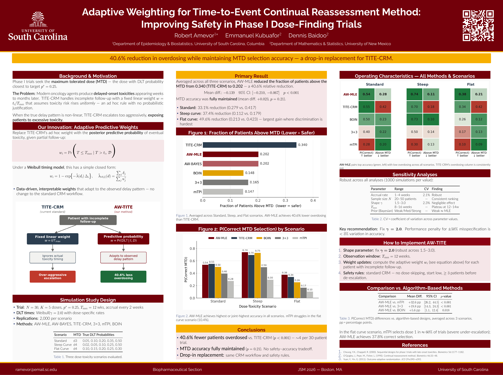

::: {.research-hero}

## Adaptive Weighting for the Time-to-Event Continual Reassessment Method

**Improving safety in Phase I dose-finding trials**

Robert Amevor1*, Emmanuel Kubuafor2, Dennis Baidoo2

1 Department of Epidemiology & Biostatistics, University of South Carolina  
2 Department of Mathematics & Statistics, University of New Mexico

:::

::: {.callout-important}
### Key finding

**40.6% relative reduction in the fraction of patients above the maximum tolerated dose (MTD)** compared with TITE-CRM, while maintaining MTD-selection accuracy.
:::

## Why this research matters

Phase I oncology trials seek the **maximum tolerated dose (MTD)** while protecting patients from excessive toxicity. The Time-to-Event Continual Reassessment Method (TITE-CRM) accommodates delayed toxicity by assigning a fixed linear follow-up weight.

The limitation is that this linear rule assumes toxicity risk increases uniformly over the observation window. When the true timing of toxicity is nonlinear, this can lead to overly aggressive dose escalation and unnecessary patient exposure.

## Our approach: adaptive predictive weights

This project replaces the ad hoc linear TITE-CRM weight with an adaptive predictive probability of eventual toxicity based on the patient's observed follow-up and the estimated toxicity-timing distribution.

Under a Weibull timing model, the adaptive weight is based on the posterior/predictive probability of eventual toxicity. The approach is designed as a **drop-in replacement** for the weighting step while retaining the standard CRM workflow and safety rules.

## Simulation study

The simulation study used:

- **30 patients** per trial
- **5 dose levels**
- Target DLT probability **p* = 0.25**
- Maximum follow-up window **12 weeks**
- Accrual every **2 weeks**
- **2,000 replications** per scenario
- Three dose-toxicity scenarios: standard, steep, and flat
- Comparators: **AW-MLE, AW-BAYES, TITE-CRM, 3+3, mTPI, and BOIN**

## Main results

Across the three scenarios, AW-MLE reduced the fraction of patients treated above the MTD from **0.340 with TITE-CRM to 0.202**, corresponding to a **40.6% relative reduction**.

The reduction was accompanied by maintained MTD-selection accuracy, with a mean difference of **+0.023 (p = 0.21)** relative to TITE-CRM.

### Reduction in overdosing by scenario

| Scenario | Reduction vs. TITE-CRM |
|:--|--:|
| Standard curve | 33.1% |
| Steep curve | 37.4% |
| Flat curve | 49.6% |

The largest gain occurred in the flat-curve scenario, where dose discrimination is most difficult.

## Poster figures

### Fraction of patients above the MTD

[Open the full JSM 2026 poster (PDF) →](../files/posters/JSM_2026_AW_TITE_Poster.pdf){target="_blank"}

## Robustness and implementation

Sensitivity analyses varied accrual rate, sample size, Weibull shape, observation window, and Bayesian prior strength. The poster reports robust performance across these settings, with limited sensitivity to Weibull shape misspecification and recommends fixing **gamma = 2.0** for implementation.

A practical implementation uses the adaptive weight for each patient with incomplete follow-up while retaining standard CRM safety rules, including no dose-skipping, conservative starting doses, and minimum patient counts before de-escalation.

## Comparison with algorithm-based designs

The poster also reports higher correct-MTD selection for AW-MLE compared with several algorithm-based methods when averaged across the three scenarios:

| Comparison | Mean difference | 95% CI | p-value |
|:--|--:|:--|--:|
| AW-MLE vs. mTPI | +32.6 pp | [26.2, 44.5] | < 0.001 |
| AW-MLE vs. 3+3 | +19.8 pp | [14.3, 24.3] | < 0.001 |
| AW-MLE vs. BOIN | +5.6 pp | [1.1, 12.4] | 0.018 |

## Dissemination

- **Joint Statistical Meetings (JSM) 2026, Boston, MA** - Poster presentation.
- **Statistics in Pharmaceuticals (SIP) 2026** - Poster presentation scheduled for August 19, 2026.
- **Statistics in Medicine** - Manuscript under review; submitted January 23, 2026.

## Citation

Amevor, R., Kubuafor, E., & Baidoo, D. (2026). *Adaptive Weighting for Time-to-Event Continual Reassessment Method: Improving Safety in Phase I Dose-Finding Through Data-Driven Delay Distribution Estimation.* arXiv:2602.19012. Manuscript under review at *Statistics in Medicine*.

[View the arXiv preprint →](https://doi.org/10.48550/arXiv.2602.19012){target="_blank"}

## Poster

<iframe src="../files/posters/JSM_2026_AW_TITE_Poster.pdf" width="100%" height="850px" style="border: 1px solid #ddd; border-radius: 8px;"></iframe>

<a href="../files/posters/JSM_2026_AW_TITE_Poster.pdf" target="_blank">Open poster in a new tab</a>

